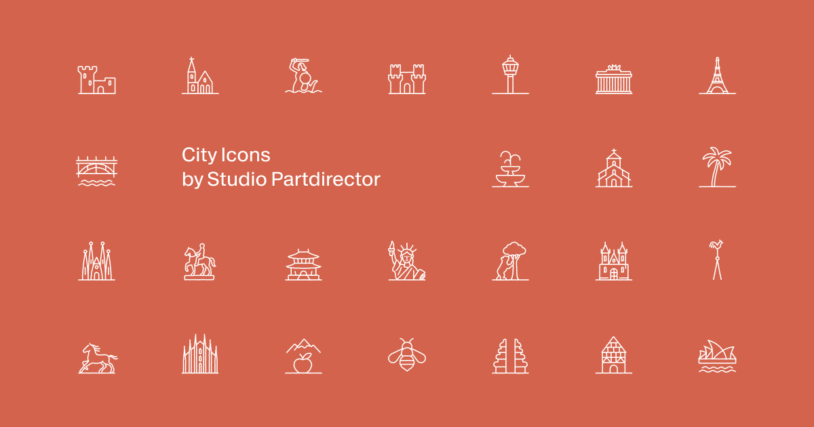

<p align="center">
  <a href="https://svgcities.com">
    
  </a>
</p>

<h1 align="center">City Icons</h1>

<p align="center">
  <strong>273 minimalist line-art SVG icons representing cities and their landmarks from around the world.</strong>
</p>

<p align="center">
  <a href="https://svgcities.com">Live Site</a> ·
  <a href="https://svgcities.com/whats-new">What's New</a> ·
  <a href="https://svgcities.com/statistics">Statistics</a> ·
  <a href="https://svgcities.com/faq">FAQ</a> ·
  <a href="https://svgcities.com/roulette">City Roulette</a>
</p>

<p align="center">
  
  
  
  
  
</p>

---

## What is this?

A curated collection of hand-designed SVG icons — each one captures a city through its most recognizable landmark, symbol, or architectural feature. From the Eiffel Tower to the Sydney Opera House, from Tokyo's temples to Cairo's pyramids.

Browse, search, download, and copy — all for free.

**[→ Browse the collection at svgcities.com](https://svgcities.com)**

## Coverage

| Region | Icons | Example Cities |
|--------|------:|----------------|
| Europe | 114 | Paris, Barcelona, Berlin, Rome, London, Prague, Amsterdam |
| Asia | 44 | Tokyo, Seoul, Shanghai, Delhi, Kyoto, Taipei, Thimphu |
| North America | 30 | New York, San Francisco, Toronto, Chicago, Vancouver |
| Middle East | 23 | Istanbul, Jerusalem, Dubai, Tehran, Baku |
| South America | 18 | Buenos Aires, Rio de Janeiro, São Paulo, Lima, Bogotá |
| Africa | 20 | Cairo, Cape Town, Marrakesh, Nairobi, Accra, Tunis, Windhoek |
| Oceania | 11 | Sydney, Melbourne, Wellington, Perth |
| Central America | 13 | Havana, San Juan, Nassau, Antigua, Willemstad, Soufrière |

## Features

- **Browse** 273 city icons organized by country and region
- **Search** by city name, country, tag, or region
- **Download** icons as clean, scalable SVG files
- **Copy** SVG code directly to your clipboard
- **Share** direct links to individual city pages
- **Discover** random destinations with [City Roulette](https://svgcities.com/roulette)
- **Dark mode** with system preference detection

## Using the Icons

Every icon is a standalone SVG file. Grab them however you like:

**Download from the site**
Visit any city page and click Download or Copy SVG.

**Clone the repo**
```bash
git clone https://github.com/anto1/city-icons.git
# Icons are in public/icons/
ls public/icons/
# fr-paris.svg  de-berlin.svg  jp-tokyo.svg  ...
```

**Direct link**
```
https://svgcities.com/icons/fr-paris.svg
https://svgcities.com/icons/jp-tokyo.svg
```

**In HTML**
```html

```

### File Naming

All files follow the pattern `{ISO-country-code}-{city-slug}.svg`:

```
fr-paris.svg       → Paris, France
jp-tokyo.svg       → Tokyo, Japan
us-new-york.svg    → New York, USA
br-rio-de-janeiro.svg → Rio de Janeiro, Brazil
```

## Tech Stack

| Layer | Technology |
|-------|-----------|
| Framework | Next.js 15 (App Router, SSG) |
| Frontend | React 19, TypeScript 5 |
| Styling | Tailwind CSS 4 |
| UI | Radix UI, Lucide icons, Sonner |
| Analytics | Fathom |
| Deploy | Vercel |

All 273 city pages are statically generated at build time. Icons are served as static files with 1-year immutable cache headers.

## Project Structure

```
src/
├── app/                      # Next.js App Router
│   ├── page.tsx              # Homepage (all icons)
│   ├── [country]/[city]/     # Individual city pages
│   ├── faq/                  # FAQ with structured data
│   ├── statistics/           # Collection statistics
│   ├── whats-new/            # Weekly changelog
│   ├── roulette/             # City Roulette
│   └── sitemap.ts            # Dynamic XML sitemap
├── components/               # React components
├── data/icons/               # Icon metadata by region (JSON)
├── lib/                      # Utilities (slugify, constants)
└── types/                    # TypeScript interfaces

public/icons/                 # 273 SVG files
```

## Development

```bash
npm install
npm run dev       # Start dev server (Turbopack)
npm run build     # Production build (SSG)
npm run lint      # ESLint
```

## Contributing

### Request a City

Missing your city? [Send us an email](mailto:icons@partdirector.ch?subject=City%20Request&body=Please%20add%3A%20%5BCity%2C%20Country%5D) with the city name, country, and optionally the landmark you'd like to see.

### Add an Icon

1. Add your SVG to `public/icons/` using the naming convention: `{country-code}-{city}.svg`
2. Add metadata to the appropriate region file in `src/data/icons/`
3. Update `src/data/changelog.ts`
4. Run `npm run build` to verify

### Code Changes

- Use semantic HTML (`nav`, `ul/li`, `article`, `section`)
- Keep structured data valid — test with [Google Rich Results](https://search.google.com/test/rich-results)
- Use theme-aware Tailwind classes (no hardcoded colors)
- No `Math.random()` in render paths (SSG hydration)

## License

Icons are **free for personal and educational use**.
Commercial use requires permission — contact [icons@partdirector.ch](mailto:icons@partdirector.ch).

See the [full license](https://svgcities.com/license) for details.

---

<p align="center">
  Designed by <a href="https://partdirector.ch">Studio Partdirector</a>
</p>
